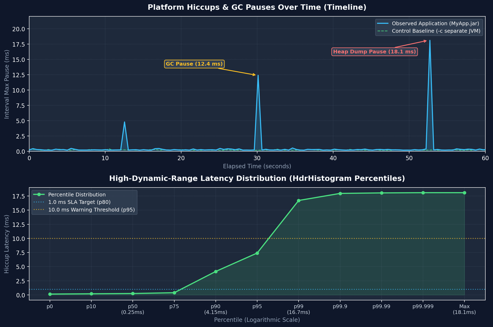

# ☕ jHiccup (Modernized Edition)

[](https://openjdk.org/)
[-blue.svg?style=flat)](http://creativecommons.org/publicdomain/zero/1.0)
[](https://github.com/bivex/jHiccup/releases/tag/v2.0.11)
[-success.svg?style=flat)]()
[]()

**jHiccup** is an ultra-low overhead (<0.05% CPU, ~70 KB RAM) instrumentation tool that measures JVM stalls, Stop-The-World GC pauses, OS scheduling delays, and hypervisor steals directly in production.

---

## ⚡ Quick Start

### 1. Java Agent Mode (Recommended)
Attach as a Java agent to any JVM process:
```bash
# Basic run (logs to hiccup.log)
java -javaagent:jHiccup.jar="-d 0 -i 1000 -l hiccup.log" -jar MyApp.jar

# With concurrent control process (measures idle baseline in a separate JVM)
java -javaagent:jHiccup.jar="-d 0 -i 1000 -l hiccup.log -c" -jar MyApp.jar
```

### 2. Wrapper Script Mode
```bash
./jHiccup -d 0 -i 1000 -l hiccup.log java -jar MyApp.jar
```

### 3. Dynamic Attach to Running JVM
```bash
java -cp $JAVA_HOME/lib/tools.jar:jHiccup.jar org.jhiccup.HiccupMeterAttacher -p <PID> -j jHiccup.jar
```

---

## 📊 Visualizing Results



### Interactive HTML5 Plotter (Recommended)
Open [`jHiccupPlotter.html`](jHiccupPlotter.html) in any browser and drag & drop your `.hlog` or `.hgrm` file to view:
- **Timeline Chart:** Interval Max & Average pauses over time.
- **Percentile Curve:** High-resolution logarithmic latency distribution (p50 to p99.999%).

### CLI Log Processor
Convert `.hlog` into human-readable percentile distribution tables:
```bash
java -cp jHiccup.jar org.jhiccup.internal.hdrhistogram.HistogramLogProcessor -i hiccup.log -o hiccup_summary.hgrm
```

---

## ⚙️ CLI Options Reference

| Option | Description | Default |
|---|---|:---:|
| `-l <file>` | Log file path (supports `%pid`, `%date`, `%host` tokens) | `hiccup.%date.%pid` |
| `-i <ms>` | Reporting interval in milliseconds | `5000` |
| `-r <ms>` | Sampling resolution in milliseconds (supports float, e.g. `0.1` for 100 µs) | `1.0` |
| `-d <ms>` | Start delay in milliseconds before measurement begins | `0` |
| `-t <ms>` | Measurement runtime limit in milliseconds (`0` for infinite) | `0` |
| `-c` | Concurrently launches an idle control process in a separate JVM (`<log>.c`) | `disabled` |
| `-cfmb <MB>`| Minimum heap threshold to trigger the control process | `0` |
| `-x "<args>"`| Extra JVM arguments passed to the control process | none |
| `-a` | Allocates a throwaway object on each tick to observe allocation stalls | `false` |
| `-0` | Starts log timestamps at `0.000` instead of JVM uptime | `false` |
| `-o` | Outputs logs in standard CSV format | `false` |
| `-s <digits>`| Number of significant value digits in histogram (1–5) | `2` |
| `-f <file>` | Processes an external latency/pause text file instead of sampling | none |
| `-fz` | Fills blank intervals with zeros (useful when parsing GC pause logs) | `false` |

---

## 🚀 Key Modernizations in v2.0.11

- **High-Precision Clocking:** `LockSupport.parkNanos()` replaces `Thread.sleep()`, delivering sub-millisecond precision and instant unparking on shutdown.
- **Graceful Shutdown:** JVM `ShutdownHook` automatically flushes unwritten buffers on SIGTERM/SIGINT.
- **Zero-Dependency HTML5 Plotter:** Native browser visualizer replacing legacy Excel VBA macros.
- **Bug Fixes:**
  - Full path quoting for directory paths containing spaces (#48).
  - Fixed monotonic clock overflow and initial sample calibration (#49).
  - Thread-safe stream draining in subprocesses to prevent OS pipe deadlocks.
  - Enforced `Locale.US` in decimal log parsers.

---

## 🔨 Building from Source

Requires JDK 8+ and Maven 3.6+:
```bash
mvn clean package
```
Build artifacts will be generated in `target/jHiccup.jar`.

---

## 📄 License

Public Domain ([CC0 1.0 Universal](http://creativecommons.org/publicdomain/zero/1.0/)).
Originally created by Gil Tene (Azul Systems).
